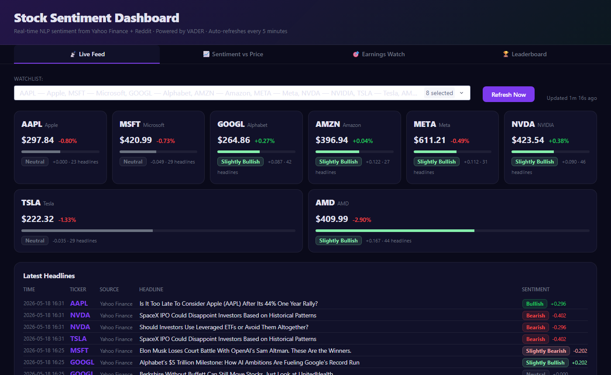
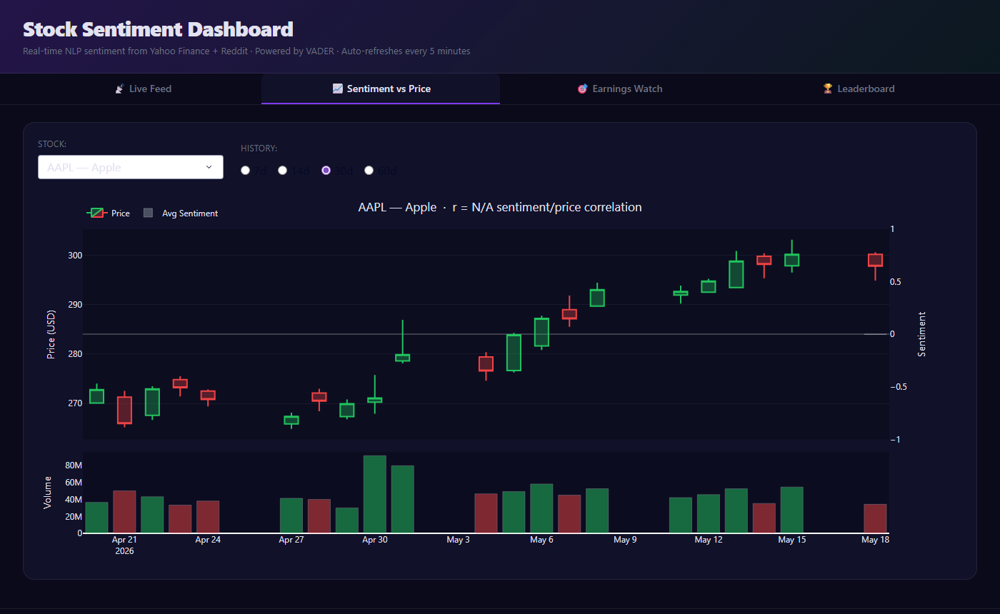
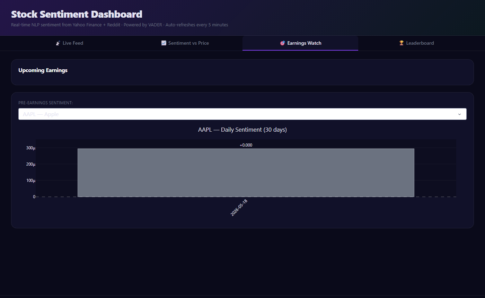
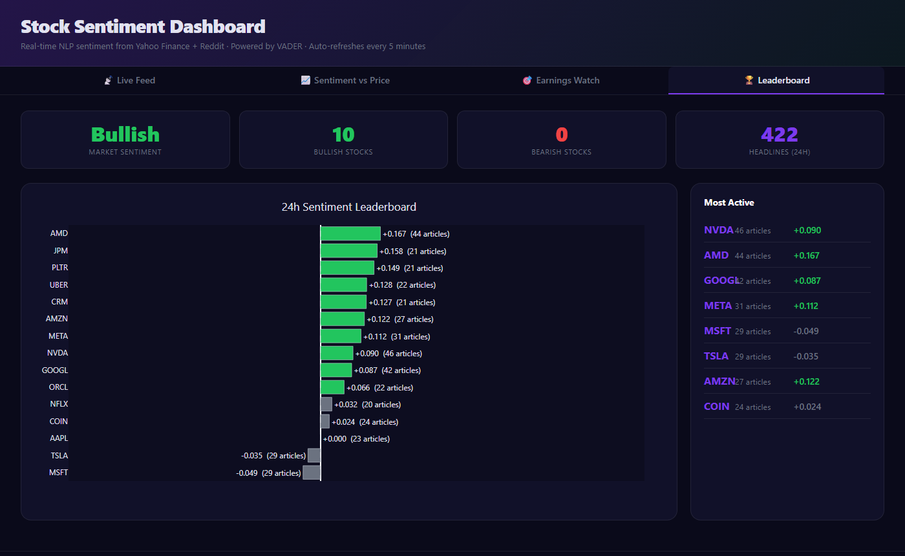

# Stock Sentiment Dashboard

> Real-time NLP sentiment analysis for 15 major stocks — live headlines from Yahoo Finance RSS + Reddit r/stocks, scored with a finance-tuned VADER model, overlaid on price charts.


## Screenshots

| Live Feed | Sentiment vs Price |
|:---------:|:-----------------:|
|  |  |

| Earnings Watch | Leaderboard |
|:--------------:|:-----------:|
|  |  |

---

## Features

### 📡 Live Feed
Real-time headline stream from **Yahoo Finance RSS** and **Reddit r/stocks**, scored per headline and displayed with colour-coded sentiment badges (Bullish / Slightly Bullish / Neutral / Slightly Bearish / Bearish). Stock cards at the top show live price, % change, and a compound sentiment meter for each ticker.

### 📈 Sentiment vs Price
Candlestick + volume chart with a **secondary sentiment overlay** — daily average VADER compound scores plotted alongside price history. Reports the Pearson correlation coefficient between sentiment and close price for the selected window (7d / 14d / 30d / 60d).

### 🎯 Earnings Watch
Upcoming earnings dates for all tracked tickers, sorted by days until event. Includes a **pre-earnings sentiment bar chart** — shows whether the market is leaning bullish or bearish in the 30 days leading up to each report.

### 🏆 Sentiment Leaderboard
24-hour sentiment ranking across all 15 stocks. Horizontal bar chart sorted by VADER compound score with headline counts. KPI tiles show market-wide sentiment, bullish/bearish stock counts, and total headlines processed.

---

## Tracked Tickers

| Symbol | Company       | Symbol | Company     | Symbol | Company     |
|--------|---------------|--------|-------------|--------|-------------|
| AAPL   | Apple         | NVDA   | NVIDIA      | ORCL   | Oracle      |
| MSFT   | Microsoft     | TSLA   | Tesla       | CRM    | Salesforce  |
| GOOGL  | Alphabet      | AMD    | AMD         | UBER   | Uber        |
| AMZN   | Amazon        | NFLX   | Netflix     | COIN   | Coinbase    |
| META   | Meta          | JPM    | JPMorgan    | PLTR   | Palantir    |

---

## Tech Stack

| Layer       | Technology                                           |
|-------------|------------------------------------------------------|
| UI          | Plotly Dash 4.x + Dash Bootstrap Components          |
| Charts      | Plotly 6.x — candlestick, bar, dual y-axis overlays  |
| NLP         | VADER (`vaderSentiment`) + financial domain boosters |
| Data        | Yahoo Finance RSS (`feedparser`) + Reddit JSON API   |
| Prices      | `yfinance` — OHLCV history + live quotes + earnings  |
| Storage     | SQLite (`data/sentiment.db`) — 60-day rolling window |
| Scheduler   | APScheduler `BackgroundScheduler` — 5-min auto-refresh |

---

## VADER Financial Boosters

Standard VADER is trained on social media and underweights financial vocabulary. The lexicon is patched at startup with domain-specific boosts:

```python
"surge": +1.5,  "plunge": -1.5,  "crash": -1.5,  "beat": +1.2,
"miss":  -1.2,  "upgrade": +1.3, "downgrade": -1.3, "bankruptcy": -2.0,
"layoffs": -1.0, "fraud": -1.8,  "rally": +1.2,  "breakout": +1.3
# ... and more
```

---

## Quick Start

```bash
# Clone
git clone https://github.com/OzSpidey/stock-sentiment-dashboard.git
cd stock-sentiment-dashboard

# Install dependencies
pip install -r requirements.txt

# Run
python dashboard.py
# Open http://localhost:8050
```

The first run fetches ~15 tickers × 2 sources in the background — the UI renders immediately and populates as data arrives (30–60 seconds).

---

## Project Structure

```
stock-sentiment-dashboard/
├── dashboard.py        # Plotly Dash app — layout + all callbacks
├── config.py           # Tickers, colours, thresholds, DB path
├── fetcher.py          # Yahoo Finance RSS + Reddit r/stocks scrapers
├── sentiment.py        # VADER scoring with financial boosters
├── pricer.py           # yfinance — OHLCV, live quotes, earnings calendar
├── store.py            # SQLite layer — upsert, query, prune old rows
├── scheduler.py        # APScheduler background refresh (every 5 min)
├── assets/
│   └── dashboard.css   # Dark glassmorphism theme
├── data/               # Auto-created; holds sentiment.db (gitignored)
└── requirements.txt
```

---

## Data Flow

```
Every 5 minutes (APScheduler)
        │
        ├─► fetcher.fetch_all()    Yahoo RSS + Reddit → raw headlines
        ├─► sentiment.score_headlines()   VADER compound score + label
        ├─► store.upsert_headlines()      INSERT OR IGNORE into SQLite
        └─► pricer.fetch_price_history()  yfinance OHLCV → SQLite prices

Dashboard callbacks (on interval tick or user interaction)
        │
        ├─► store.get_headlines()         → Live Feed table
        ├─► pricer.get_current_quotes()   → Stock cards (live prices)
        ├─► store.get_prices() + get_daily_sentiment()  → Price chart
        ├─► pricer.get_earnings_calendar()  → Earnings Watch
        └─► store.get_sentiment_summary()   → Leaderboard
```

---

## Requirements

```
dash>=2.14.0
dash-bootstrap-components>=1.4.0
plotly>=5.17.0
pandas>=2.0.0
numpy>=1.24.0
feedparser>=6.0.10
vaderSentiment>=3.3.2
yfinance>=0.2.36
apscheduler>=3.10.1
requests>=2.31.0
```

---

## Related Projects

- [IPL Analytics Dashboard](https://github.com/OzSpidey/ipl-analytics-dashboard) — Plotly Dash dashboard with 6 tabs of IPL cricket statistics

---

*Built with Plotly Dash · VADER NLP · Yahoo Finance · Reddit*
